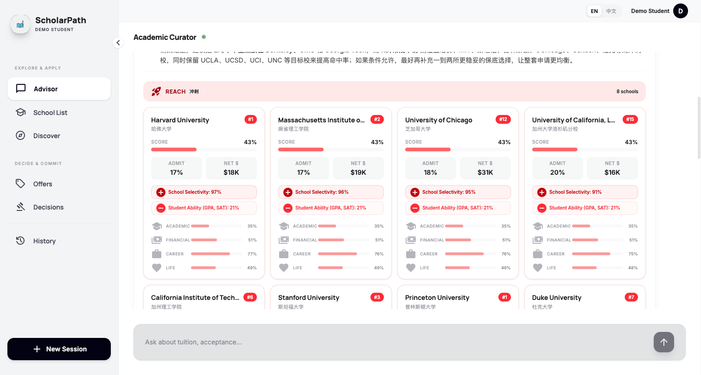
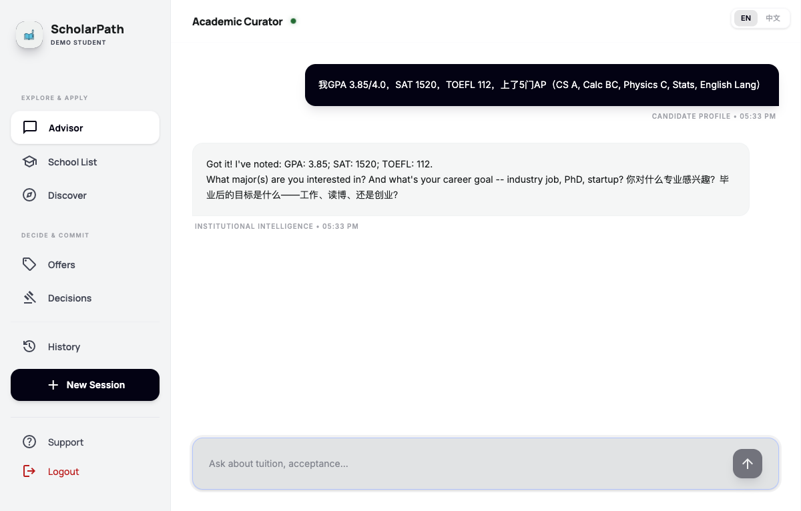
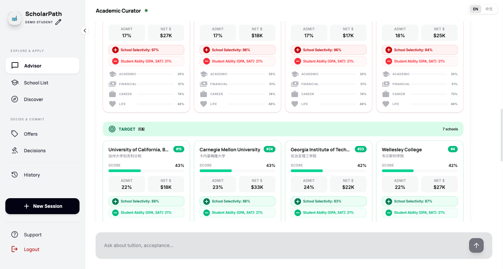
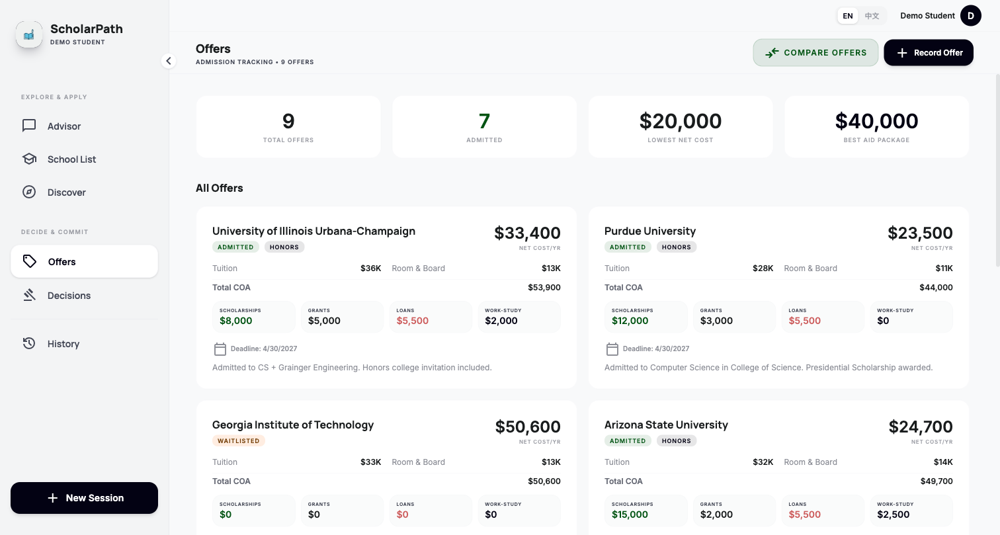
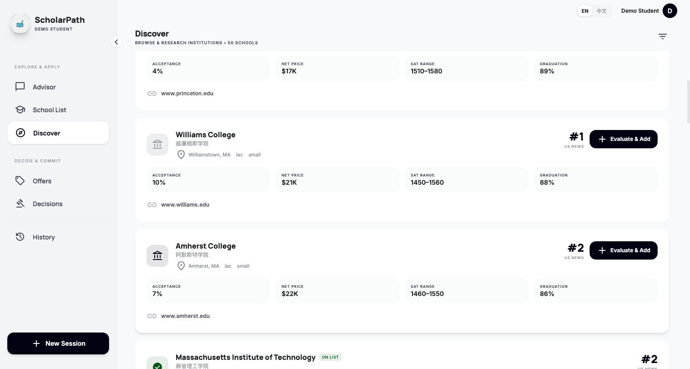
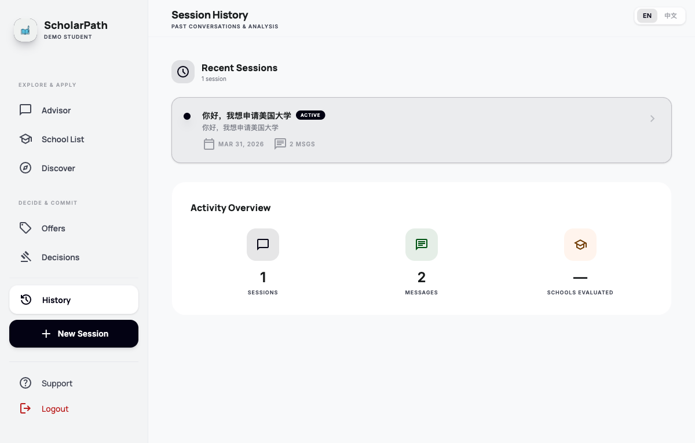

# ScholarPath

AI-powered US college admissions agent with causal inference, semantic search, and guided chat for personalized school recommendations.



## What it does

ScholarPath helps Chinese students navigate US undergraduate admissions through two core decision points:

1. **School Selection & Matching** — Guided conversational intake collects student profile (GPA, SAT, interests, budget, preferences), then uses a causal inference engine + pgvector semantic search to generate a personalized, tiered school list (Reach / Target / Safety) with explainable reasoning.

2. **Offer Comparison & Decision** — When students receive multiple offers, the system runs causal what-if analysis across academic, financial, career, and life dimensions to produce a Go/No-Go recommendation with confidence intervals.

## Screenshots

<table>
<tr>
<td width="50%">

**Guided Chat Intake**


</td>
<td width="50%">

**Causal Recommendation Cards**


</td>
</tr>
<tr>
<td>

**Offer Tracking & Comparison**


</td>
<td>

**School Discovery**


</td>
</tr>
<tr>
<td colspan="2">

**Session History**


</td>
</tr>
</table>

## Architecture

```
┌─────────────┐     ┌──────────────────────────────────────────┐
│   Frontend   │     │              Backend (FastAPI)            │
│  React/Vite  │◄───►│                                          │
│  TailwindCSS │ WS  │  Chat Agent ─► Intent Classification     │
│              │     │       │              │                    │
│  - Advisor   │     │       ▼              ▼                    │
│  - School    │     │  Guided Intake  School Query              │
│    List      │ REST│       │              │                    │
│  - Discover  │◄───►│       ▼              ▼                    │
│  - Offers    │     │  ┌─────────────────────────────┐         │
│  - Decisions │     │  │   Causal Inference Engine    │         │
│  - History   │     │  │  (CurioCat)                  │         │
│              │     │  │  - DAG Builder               │         │
└─────────────┘     │  │  - Noisy-OR Propagation       │         │
                    │  │  - do-calculus What-If         │         │
                    │  │  - Mediation Analysis          │         │
                    │  │  - Go/No-Go Scorer             │         │
                    │  └──────────┬──────────────────────┘         │
                    │             │                                │
                    │  ┌──────────▼──────────────────────┐         │
                    │  │  PostgreSQL + pgvector           │         │
                    │  │  - 64 schools (real data)        │         │
                    │  │  - Gemini 3072-dim embeddings    │         │
                    │  │  - Token usage tracking          │         │
                    │  └─────────────────────────────────┘         │
                    │             │                                │
                    │  ┌──────────▼──────────┐                     │
                    │  │  Redis               │                     │
                    │  │  - Chat memory       │                     │
                    │  │  - Session state     │                     │
                    │  └─────────────────────┘                     │
                    └──────────────────────────────────────────────┘
```

## Tech Stack

| Layer | Technology |
|-------|-----------|
| Frontend | React 18, Vite, TailwindCSS 4, React Router, react-markdown |
| Backend | Python 3.12, FastAPI, WebSocket, SQLAlchemy 2.0 (async) |
| LLM | OpenAI-compatible gateway (policy-driven mode; structured calls via Chat Completions + JSON schema) |
| Embeddings | Google Gemini `gemini-embedding-001` (3072-dim) |
| Database | PostgreSQL 16 + pgvector for semantic search |
| Cache | Redis 7 (chat memory, session state, Celery broker) |
| Task Queue | Celery (deep_search/conflict + causal_train workers + beat) |
| Causal Engine | networkx + numpy (DAG, Noisy-OR, do-calculus) |
| Deploy | Docker Compose (7 services) |

Architecture and gateway design reference:
- `project/scholarpath_architecture_gateway_v2.md`

## Key Features

- **Causal Inference Engine** — Domain-constrained DAG with 16 admission-relevant nodes, Noisy-OR belief propagation, do-calculus for what-if simulation, mediation analysis decomposing school effects into 4 causal pathways (research opportunities, peer network, brand signal, career services)
- **Guided Conversational Intake** — 7-step profile builder with interactive option cards (click to select or type custom answers), auto-detects user language (EN/ZH)
- **pgvector Semantic Search** — Gemini embeddings for student profiles and schools, cosine similarity pre-filtering before causal evaluation
- **Structured Recommendation Cards** — Tiered school list (Reach/Target/Safety) with per-school score bars, admission probability, net price, causal reason pills, and 4-dimension fit analysis
- **Session Persistence** — Redis-backed chat history with URL routing (`/s/{sessionId}/{nav}`), survives page reloads
- **Token Usage Tracking** — Every LLM call logged to DB with model, caller, tokens, latency, errors; queryable via `/api/usage/summary`
- **Rate Limiting** — 100 RPM sliding window on LLM calls
- **i18n** — Full EN/ZH bilingual UI, auto-detects from user input
- **Collapsible Sidebar** — Icon-only mode for more content space

## Quick Start

```bash
# Clone and start all services
git clone https://github.com/your-username/ScholarPath.git
cd ScholarPath
docker compose up --build -d

# Verify Celery queues
docker compose exec celery_worker celery -A scholarpath.tasks.celery_app inspect active_queues
docker compose exec celery_causal_train_worker celery -A scholarpath.tasks.celery_app inspect active_queues

# One-time cleanup before a fresh rollout (records + clears backlog)
docker compose exec redis redis-cli -n 0 LLEN deep_search
docker compose exec redis redis-cli -n 0 LLEN conflict
docker compose exec redis redis-cli -n 0 DEL deep_search conflict

# Services:
#   http://localhost:5173  — Frontend (Vite)
#   http://localhost:8000  — Backend API (FastAPI)
#   localhost:55432        — PostgreSQL + pgvector
#   localhost:56379        — Redis

# Seed school data + demo student
curl -X POST http://localhost:8000/api/api/seed/schools
curl -X POST http://localhost:8000/api/api/seed/demo-student
curl -X POST http://localhost:8000/api/api/seed/demo-evaluations

# Enrich with real data via LLM
curl -X POST http://localhost:8000/api/enrich/schools

# Open http://localhost:5173 and start chatting
```

### Testing

```bash
# Single-process
python -m pytest -q

# Parallel (recommended on multi-core machines)
python -m pytest -n auto -q
```

### Environment Variables

Copy `.env.example` to `.env` and fill in:

```
LLM_GATEWAY_POLICIES_PATH=scholarpath/data/llm_gateway_policies.json
LLM_ACTIVE_MODE=beecode
LLM_ACTIVE_POLICY=default
LLM_RATE_LIMIT_RPM=200
LLM_REQUEST_TIMEOUT_SECONDS=4.5
BEECODE_API_KEY_1=key-1
BEECODE_API_KEY_2=key-2
BEECODE_API_KEY_3=key-3
XCODE_API_KEY_1=xcode-key-1
XCODE_API_KEY_2=xcode-key-2
# Optional: enable DeepSearch web source
WEB_SEARCH_API_URL=
WEB_SEARCH_API_KEY=
GOOGLE_API_KEY=your-gemini-api-key
SCORECARD_API_KEY=your-data-gov-college-scorecard-api-key
# Optional: IPEDS/CN official bulk dataset (CSV/JSON)
IPEDS_DATASET_URL=
IPEDS_DATASET_PATH=
# Optional: Common App trend-only dataset (CSV/JSON)
COMMON_APP_TREND_URL=
COMMON_APP_TREND_PATH=
# Optional: tune DeepSearch throughput
DEEPSEARCH_SCHOOL_CONCURRENCY=8
DEEPSEARCH_SOURCE_HTTP_CONCURRENCY=16
DEEPSEARCH_SELF_EXTRACT_CONCURRENCY=12
DEEPSEARCH_INTERNAL_WEBSEARCH_CONCURRENCY=8
```

`LLM_GATEWAY_POLICIES_PATH` points to a versioned JSON policy file that defines:
- endpoint list per mode (`base_url/model/api_key_env/rpm`)
- caller-to-endpoint preferred routing (`route`)
- method-level tuning (`call_defaults`, `endpoint_overrides`, `caller_overrides`)

### Real Admission Pipeline (strict mini-before-full)

```bash
python -m scholarpath.scripts.causal_real_admission_pipeline \
  --ingest-ipeds \
  --top-schools 1000 \
  --years 5 \
  --school-selection applicants \
  --ingest-common-app-trends \
  --events-file scholarpath/data/admission_events_seed.json \
  --cycle-year 2026 \
  --max-rpm-total 180 \
  --judge-concurrency 2 \
  --full-candidates 3
```

The script enforces `Gate0 (docker+alembic+tables) -> mini gate -> full stage4 K=3` and does **not** auto-promote the full-run champion. Common App signals are trend-only and are not used as causal truth labels.

## API Endpoints

| Endpoint | Description |
|----------|-------------|
| `WS /api/chat/chat/{sessionId}` | Real-time chat via WebSocket |
| `POST /api/chat/route-turn` | RoutePlan-controlled one-turn execution (`route_plan + skill_id`) |
| `GET /api/chat/history/{sessionId}` | Load chat history |
| `GET /api/schools/` | Search & list schools |
| `GET /api/evaluations/students/{id}/tiers` | Tiered school list |
| `POST /api/offers/students/{id}/offers` | Record admission offers |
| `POST /api/simulations/students/{id}/schools/{id}/what-if` | Causal what-if simulation |
| `POST /api/reports/students/{id}/offers/{id}/go-no-go` | Generate Go/No-Go report |
| `POST /api/vectors/search/schools` | pgvector semantic school search |
| `GET /api/usage/summary` | Token usage analytics (`?days=` optional) |
| `GET /api/sessions/student/{id}` | List chat sessions |
| `POST /api/students/{id}/admission-evidence` | Write evidence artifact (authoritative) |
| `POST /api/students/{id}/admission-events` | Write admission event (authoritative) |
| `GET /api/causal/datasets/{version}` | Read causal dataset version |

## Project Structure

```
scholarpath/
├── api/              # FastAPI routes + Pydantic schemas
├── causal/           # CurioCat causal inference engine
│   ├── dag_builder.py        # Domain-constrained DAG (16 nodes, 22 edges)
│   ├── belief_propagation.py # Noisy-OR propagation
│   ├── do_calculus.py        # Interventional what-if analysis
│   ├── mediation.py          # Causal pathway decomposition
│   ├── backdoor.py           # Confounder adjustment
│   └── go_no_go.py           # Composite scoring engine
├── chat/             # Chat agent + guided intake handlers
├── search/           # Open DeepSearch engine
├── services/         # Business logic (recommendation, evaluation)
├── llm/              # LLM client + embeddings + usage tracking
├── db/               # SQLAlchemy models (11 tables + pgvector)
└── tasks/            # Celery async tasks

frontend/src/
├── app/components/   # React components (ChatPanel, RecommendationCard, etc.)
├── hooks/            # useChat, useEvaluations, useStudent
├── context/          # AppContext (session, student, sidebar state)
├── lib/              # API client + TypeScript types
└── i18n/             # EN/ZH translations
```

## License

MIT
